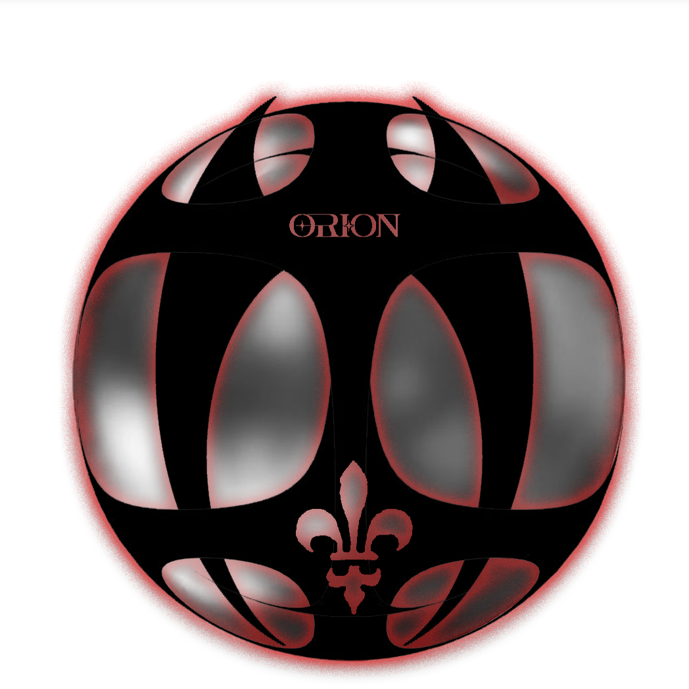

<div align="center">



# Orion Terminal

**A JARVIS-style personal workstation — one desktop shell, three deeply-integrated apps, with Claude embedded inside each as a context-aware collaborator.**

[](https://tauri.app)
[](https://react.dev)
[](https://www.typescriptlang.org)
[](https://www.rust-lang.org)


</div>

---

## What it is

Orion Terminal is a single desktop OS-style shell — wallpaper, menubar, dock, draggable in-canvas windows, and a unified Spotlight (`⌘K`) — hosting three first-class apps. Claude lives **inside** each app, not in a side panel, so it always has the context of what you're doing.

| App | What it is | Accent |
| --- | --- | --- |
| 🟢 **Archives 47** | Personal Notion — notes, journal, mood boards, media, databases, `[[wikilinks]]` + backlinks, RAG search | Green |
| 🔵 **Orion** | AI-first code editor — file tree, Monaco, live preview, terminal, Git panel, real LSP, inline Claude edits + Tab autocomplete | Cyan |
| 🟣 **XDesign** | Design studio — generative design engine, brand systems, vector boolean ops, prototypes, decks (HTML/PDF/PPTX), an editable canvas | Magenta |

All three share one command registry, one Claude brain, and a cross-app memory surfaced in Spotlight.

## Highlights

- **In-canvas windowing** — one OS window; apps are React components positioned in an HTML canvas. Drag at 60fps, true fullscreen + `⌃⌘Tab` app-switcher.
- **Claude, embedded** — subscription path via the Claude CLI subprocess; inline-edit path via the Messages API with an OS-keychain key. Streaming feels like claude.ai.
- **5 themes** — Neon (default), Liquid (frosted glass + WebGL refraction), Minimal, Modern, BMW M.
- **Local-first** — SQLite via `tauri-plugin-sql`, append-only migrations, atomic file saves, rotating backups.
- **R.O.S.I.E.** — a cross-app assistant that can "catch you up" across everything you've been doing.

## Tech stack

Tauri 2 · React 19 · Vite · TypeScript · Rust · Monaco · BlockNote · xterm.js · Zustand · SQLite · `fuse.js` · Three.js

## Getting started

**Prerequisites:** [Node 20+](https://nodejs.org), [Rust (stable)](https://rustup.rs), and the [Tauri 2 system deps](https://tauri.app/start/prerequisites/).

```bash
# install JS deps
npm install

# run the app in dev (hot-reload)
npm run tauri dev

# type-check + unit tests
npm run build      # tsc + vite build
npm test           # vitest

# produce a release .app + .dmg
npm run tauri build
```

Optional language servers for Orion's LSP features:

```bash
npm i -g typescript-language-server typescript pyright
rustup component add rust-analyzer
```

## Project structure

```
src/shell/        wallpaper, menubar, dock, windowframe, spotlight, fullscreen nav
src/apps/         archives · orion · xdesign · command · hermes
src/components/   ClaudeChat (props-driven, reused per app) + workspace
src/features/     auth, onboarding, settings, lsp, ai edits, rosie, …
src/styles/       design tokens + themes
src-tauri/        Rust backend — 104 commands (SQLite, providers, image gen, MCP)
```

## Beta

This is a personal-use **beta v1**. See **[BETA.md](BETA.md)** for install steps (the macOS build is unsigned), what to test, and how to report issues.

## Roadmap

- ✅ Orion ≥ Cursor · Archives ≥ Notion · XDesign ≥ Figma (single-player)
- ✅ One terminal, one brain — notification center, cross-app memory, ROSIE catch-up
- ⬜ Terminal plugin system + community marketplace *(scoped post-beta)*

## License

Personal project — not yet licensed for redistribution. © 2026 Orion Terminal.
