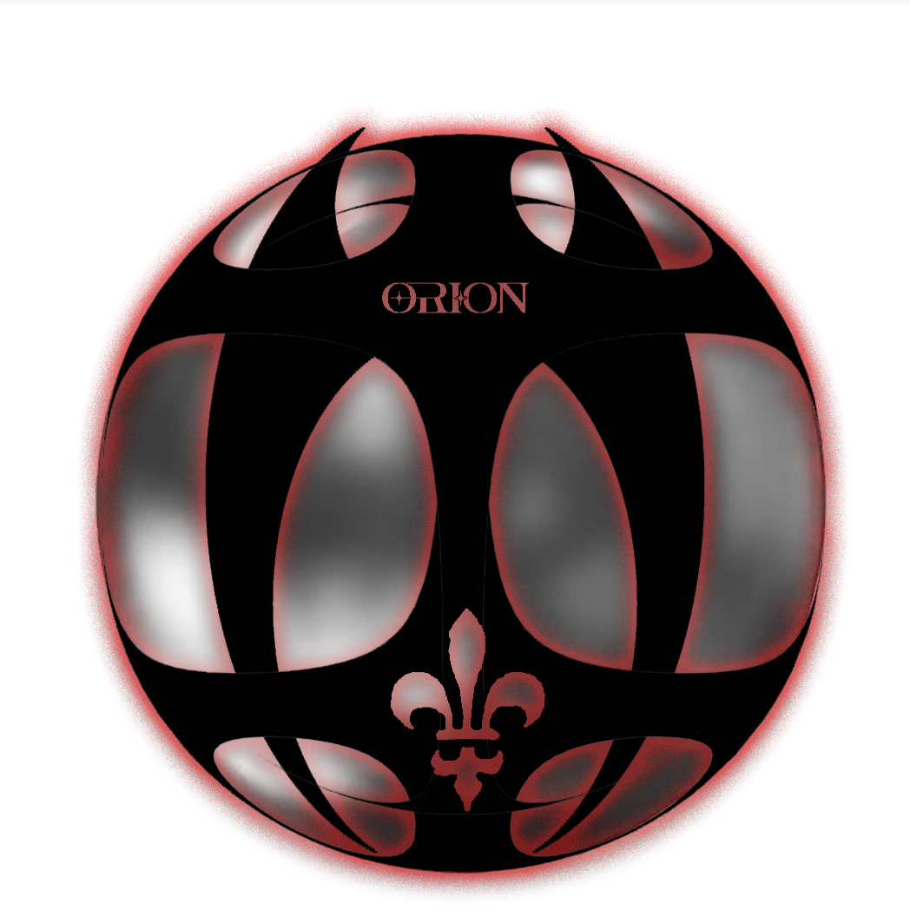

<div align="center">



# Orion Terminal

**A JARVIS-style personal workstation — one desktop shell, deeply integrated apps, and your choice of context-aware AI collaborator.**

[](https://tauri.app)
[](https://react.dev)
[](https://www.typescriptlang.org)
[](https://www.rust-lang.org)


### [⬇️ Releases for macOS (Apple Silicon)](https://github.com/chakra3301/OrionTerminal/releases)

[](https://github.com/chakra3301/OrionTerminal/releases)

</div>

---

## Download & install (macOS, Apple Silicon)

**Public alpha**, not a stable release. Choose `v0.1.0-alpha.1` for these changes; earlier beta downloads predate them. See the [alpha guide](BETA.md).

1. Choose a **`.dmg`** from the [**Releases page**](https://github.com/chakra3301/OrionTerminal/releases). For the new alpha, compare its SHA-256 with the attached `SHA256SUMS.txt` before opening it.
2. Open the `.dmg` and drag **Orion Terminal** into **Applications**.
3. The app is **ad-hoc signed, not notarized**, so macOS may warn it can’t verify the developer. Approve only a build you trust:
   - **macOS 14 Sonoma & earlier:** right-click the app → **Open** → **Open** in the dialog.
   - **macOS 15 Sequoia & later:** double-click (it’s blocked once), then go to **System Settings → Privacy & Security** → scroll down → **Open Anyway**.
   - If macOS refuses approval, stop and report the exact warning. Do not disable Gatekeeper.
4. First launch shows a glass **Username** input, then **Password**. Use the arrow or Enter to continue; the skip icon (**Skip sign-in**) continues without an account. This is a local privacy gate, not encryption. The stock wallpaper is still by default; enable Matrix/Core in **Control Panel → Wallpaper**, or choose **Off**. Only Archives, Orion and XDesign start enabled; additional apps remain available in **Control Panel → Plugins**. Existing saved preferences are preserved.

> macOS Apple Silicon (`aarch64`) is the release target. Other platforms are not verified. See [Getting started](#getting-started).

---

## What it is

Orion Terminal is a single desktop OS-style shell — wallpaper, menubar, dock, draggable in-canvas windows, and a unified Spotlight (`⌘K`) — hosting three core apps plus Hermes and Command. Shared AI rails receive app-specific context and use the connector/model you select. Specialist capabilities differ; see the [setup and capability matrix](docs/setup-and-verification.md).

| App | What it is | Accent |
| --- | --- | --- |
| 🟢 **Archives 47** | Personal Notion — notes, journal, mood boards, media, databases, `[[wikilinks]]` + backlinks, RAG search | Green |
| 🔵 **Orion** | AI-first code editor — file tree, Monaco, live preview, terminal, Git panel, real LSP, inline Claude edits + Tab autocomplete | Cyan |
| 🟣 **XDesign** | Design studio — generative design engine, brand systems, vector boolean ops, prototypes, decks (HTML/PDF/PPTX), an editable canvas | Magenta |

All three share a command registry, configurable AI routing, and cross-app memory surfaced in Spotlight.

## Highlights

- **In-canvas windowing** — one OS window; apps are React components positioned in an HTML canvas. Drag at 60fps, true fullscreen + `⌃⌘Tab` app-switcher.
- **Choose your AI** — Claude, ChatGPT/Codex, Gemini, Cursor SDK, and configured API/local connectors. Set a global default or choose per surface. Inline editing and Tab completion still use the Anthropic API.
- **5 themes** — Neon (default), Liquid (frosted glass + WebGL refraction), Minimal, Modern, BMW M.
- **Local-first** — SQLite via `tauri-plugin-sql`, append-only migrations, atomic file saves, rotating backups.
- **R.O.S.I.E.** — a cross-app assistant that can "catch you up" across everything you've been doing.

## Tech stack

Tauri 2 · React 19 · Vite · TypeScript · Rust · Monaco · BlockNote · xterm.js · Zustand · SQLite · `fuse.js` · Three.js

## Getting started

**Prerequisites:** [Node 22.13+](https://nodejs.org), [Rust (stable)](https://rustup.rs), and the [Tauri 2 system deps](https://tauri.app/start/prerequisites/).

```bash
# install locked JS deps
npm ci

# run the app in dev (hot-reload)
npm run tauri dev

# inspect setup without printing credentials or making AI requests
npm run doctor

# type-check, frontend/bridge/native tests, and production web build
npm run verify

# produce a release .app + .dmg
npm run tauri build
```

Optional language servers for Orion's LSP features:

```bash
npm i -g typescript-language-server typescript@5 pyright
rustup component add rust-analyzer
```

## Project structure

```
src/shell/        wallpaper, menubar, dock, windowframe, spotlight, fullscreen nav
src/apps/         archives · orion · xdesign · command · hermes
src/components/   ClaudeChat (props-driven, reused per app) + workspace
src/features/     auth, onboarding, settings, lsp, ai edits, rosie, …
src/styles/       design tokens + themes
src-tauri/        Rust backend — SQLite, connectors, image generation, MCP
```

## Verification and release status

**The current working tree is still under pre-release validation.** Test results apply to the recorded builds, not automatically to older assets on the Releases page. Use disposable projects and back up important data. Unverified specialist workflows are experimental; shared connector support does not establish every model entitlement or subscription/API billing equivalence.

[Setup, connector limitations, and smoke tests](docs/setup-and-verification.md) · [Polish audit and remaining gates](docs/aaa-rebuild/2026-09-11-polish-audit.md).

Automated verification is not desktop or provider sign-off. The release workflow blocks known critical production dependency advisories; unresolved findings are documented, not silently ignored.

## Beta

This is a personal-use **beta v1**. See **[BETA.md](BETA.md)** for install steps (personal macOS builds are ad-hoc signed, not notarized), what to test, and how to report issues.

## Roadmap

- Core editor, archives and single-player design feature tracks implemented; competitor parity and broad acceptance are not certified.
- ✅ One terminal, one brain — notification center, cross-app memory, ROSIE catch-up
- ⬜ Terminal plugin system + community marketplace *(scoped post-beta)*

## License

Original code and creator-owned bundled character/companion models are licensed under [Apache-2.0](LICENSE). See [NOTICE](NOTICE) and [third-party notices](THIRD_PARTY_NOTICES.md) for attribution and exceptions. User-imported content and third-party dependencies retain their own licenses. Licensing the original work does not certify every optional integration for redistribution; current release gates are tracked in [the closure audit](docs/aaa-rebuild/2026-09-11-release-closure.md).
